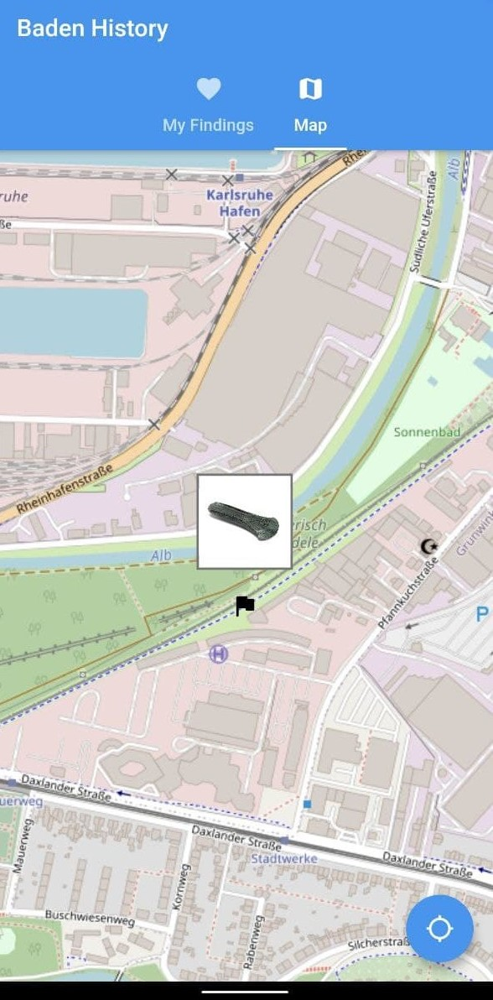
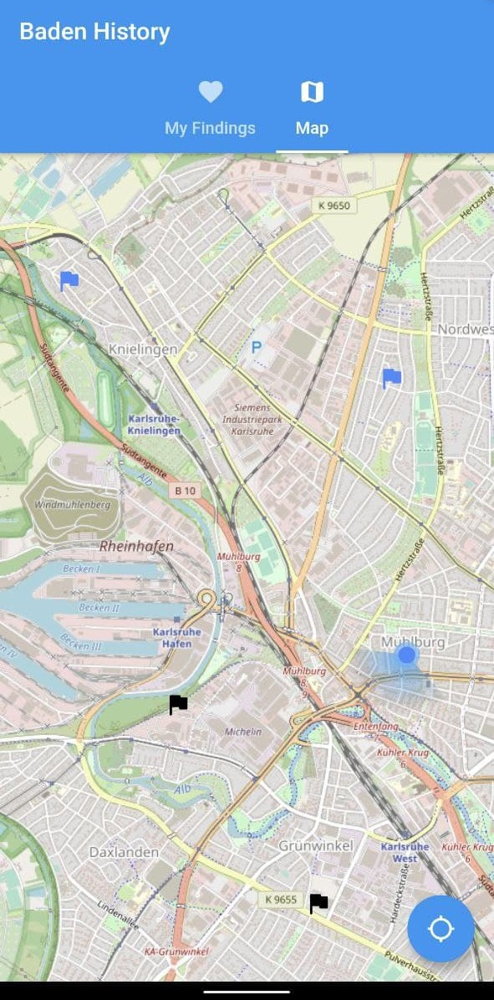
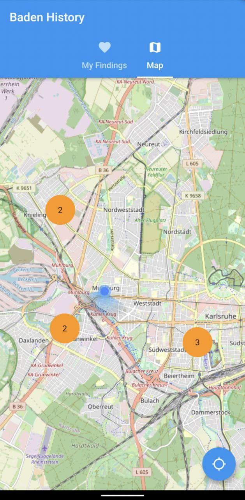
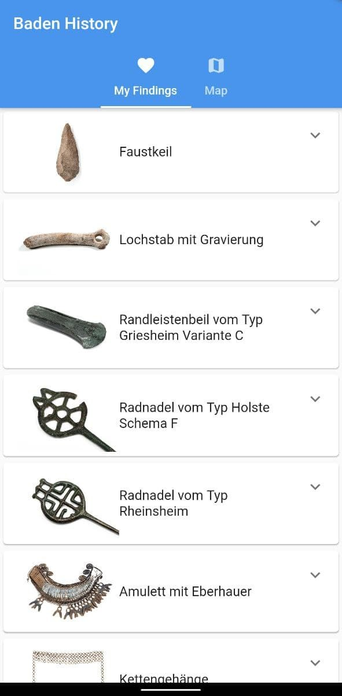
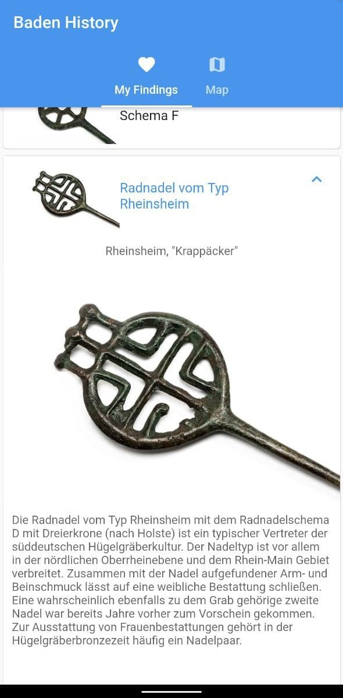
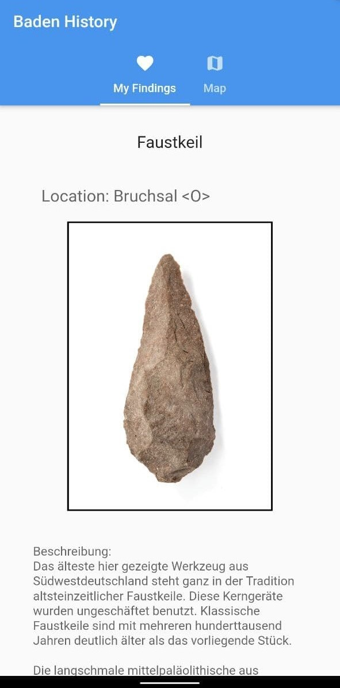

# BadenHistory

If people don't come to the museum, the museum has to come to the people. Share your thoughts, collaborate and discover the history of Baden.

## Inspiration

Location-based communication about history does not currently take place in a larger community. We want to change that!

## What it does

To expand the possibilities of museums, we have designed and built a digital platform that enables the exploration of culture on the streets within the city. Our goal is to encourage people to talk about history in a forum that lowers inhibitions through asynchronous communication while increasing the incentive by scattering collectible digital exhibits around the city. Therefore we provide a cultural digital geocaching platform with gamification.

## How we built it

With teamwork :D. We also use Flutter as a platform independent user interface language and Dart as programming language. For the backend we use Docker and the Python framework flask combined with a SQLite database.

## Challenges we ran into

Bring together different technologies into an amazing platform.

## Accomplishments that we're proud of

The platform independence of our project due to Flutter and Docker.

## What we learned

Design, both UI and API. Learning about the opportunities of the digital future of museums. How to motivate citizens to learn about the history of their own city and bring museums into their daily life.

## What's next for BadenHistory

Add custom tours with external links to other museums and online sources. Recommender system for similar exhibits. Rating system for exhibits and tours. Custom events and polls.

## The app

Here are some impressions from our app:

Already visited exhibits are shown in black while not places that are not visited yet are shown in blue. When zoomed out the exhibits gets clustered for an easier overview. The exhibits are distributed around the city to motivate people to explore their own city.

There is a list of all the exhibit that were already found and explored. It is possible to show more details on the exhibits by expanding the information or changing to the detail page.

Also there is a chat function to talk about events.

